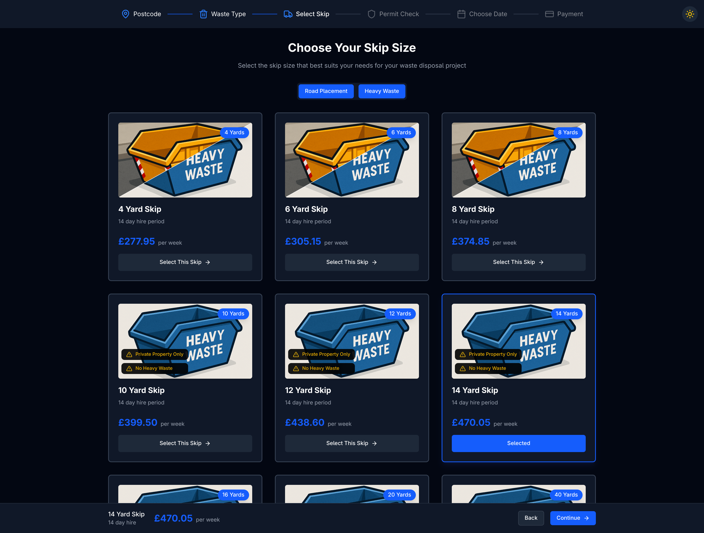
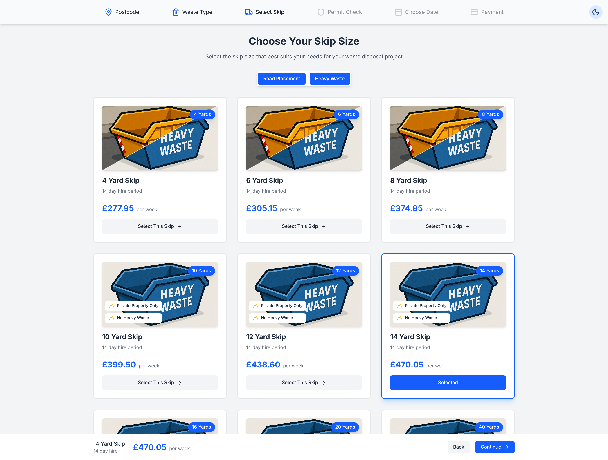

# Skip Hire Selector App

A modern, responsive web application for selecting skip hire services with dark and light theme support.



## Features

- **Interactive Skip Selection**: Browse through various skip sizes with detailed information about each option
- **Smart Filtering**: Filter skips by road placement compatibility and heavy waste capability
- **Step-by-Step Navigation**: Clear navigation showing the current step in the hire process
- **Responsive Design**: Fully responsive layout that works on mobile, tablet, and desktop devices
- **Dark/Light Theme Toggle**: Switch between dark and light modes based on user preference



## Technology Stack

- React with TypeScript
- React Hooks (useState, useEffect, useMemo)
- Tailwind CSS for styling
- Responsive design patterns
- Custom SVG icons

## Application Structure

The app consists of several key components:

- **ThemeToggle**: Controls the theme switching between dark and light modes
- **StepNav**: Displays the multi-step process navigation
- **SkipCard**: Displays individual skip options with images, pricing, and features
- **SelectionFooter**: Shows the currently selected skip and navigation controls

## Skip Features

Each skip in the system includes the following attributes:

- Size (in yards)
- Pricing information
- Hire period (in days)
- Location/postcode availability
- Road placement compatibility
- Heavy waste compatibility
- Special restrictions

## Getting Started

### Prerequisites

- Node.js (v14.0.0 or higher)
- pnpm

### Installation

1. Clone the repository:
   ```bash
   git clone https://github.com/yourusername/skip-hire-app.git
   cd skip-hire-app
   ```

2. Install dependencies:
   ```bash
   pnpm i
   ```

3. Start the development server:
   ```bash
   pnpm run dev
   ```

4. Open your browser and navigate to `http://localhost:5173`

## API Integration

The application fetches skip data from an API endpoint:
```
https://app.wewantwaste.co.uk/api/skips/by-location?postcode=NR32&area=Lowestoft
```

The API returns skip information including size, pricing, and availability constraints.

## Customization

- Modify `skipData` to change available skip options
- Update the theme colors in the component classes
- Add or remove steps in the `StepNav` component
